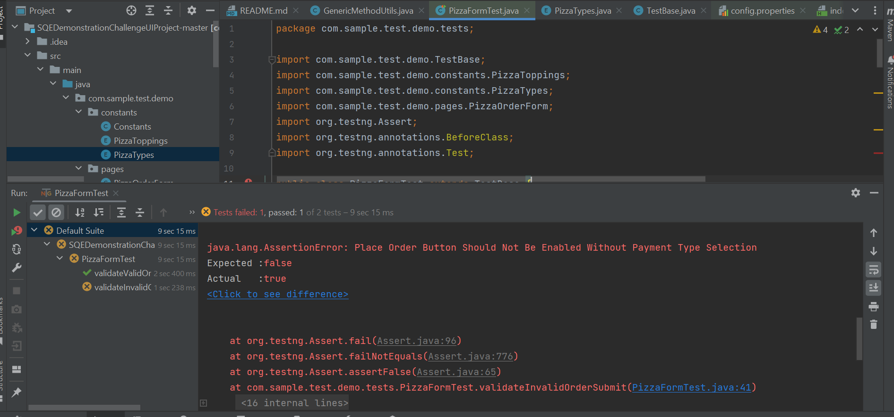

## Test Cases

Test case 1
 - Test Case name : Pizza Order form landing page
 - Test Case Category: Positive
 - Test Steps : 1. Navigate to url
 - Expected: Should display page with title Pizza Order form
 - Actual: landing page loaded

Test case 2
 - Test Case name : Order Small No topping with Cash
 - Test Case Category: Positive
 - Test Steps : 1. Select Pizza 1 as Small 6 Slices - No toppings pizza. 2. Toppings 1 & Toppings 2 dropdown should be disabled 3. Select quantity as 1 4. Enter Name & Mobile number. 5. Select payment type as cash. 6. Click on Place Order
 - Expected: Should display message like Thank you for your order!
 - Actual: Order placed and Message displayed with Thank you for your order!

Test case 3
 - Test Case name : Order Small No topping with Credit
 - Test Case Category: Positive
 - Test Steps : 1. Select Pizza 1 as Small 6 Slices - No toppings pizza. 2. Toppings 1 & Toppings 2 dropdown should be disabled 3. Select quantity as 1 4. Enter Name & Mobile number. 5. Select payment type as Credit 6. Click on Place Order
 - Expected: Should display message like Thank you for your order!
 - Actual: Order placed and Message displayed with Thank you for your order!

Test case 4
 - Test Case name : Order Small 1 topping with Cash
 - Test Case Category: Positive
 - Test Steps : 1. Select Pizza 1 as Small 6 Slices - 1 toppings pizza. 2. Select Toppings1 as olives 3. Toppings 2 dropdown should be disabled 4. Select quantity as 1 5. Enter Name & Mobile number. 6. Select payment type as Cash 7. Click on Place Order
 - Expected: Should display message like Thank you for your order!
 - Actual: Order placed and Message displayed with Thank you for your order!

Test case 5
 - Test Case name : Order Small 1 topping with Credit
 - Test Case Category: Positive
 - Test Steps : 1. Select Pizza 1 as Small 6 Slices - 1 toppings pizza. 2. Select Toppings1 as olives 3. Toppings 2 dropdown should be disabled 4. Select quantity as 1 5. Enter Name & Mobile number. 6. Select payment type as Credit 7. Click on Place Order
 - Expected: Should display message like Thank you for your order!
 - Actual: Order placed and Message displayed with Thank you for your order!

Test case 6
 - Test Case name : Order Medium 2 topping with Cash
 - Test Case Category: Positive
 - Test Steps : 1. Select Pizza 1 as Medium 8 Slices - 2 toppings pizza. 2. Select Toppings 1 as olives 3. Select Toppings 2 as Mushrooms 4. Select quantity as 1 5. Enter Name & Mobile number. 6. Select payment type as Cash 7. Click on Place Order
 - Expected: Should display message like Thank you for your order!
 - Actual: Order placed and Message displayed with Thank you for your order!

Test case 7
 - Test Case name : Order Medium 2 topping with Credit
 - Test Case Category: Positive
 - Test Steps : 1. Select Pizza 1 as Medium 8 Slices - 2 toppings pizza. 2. Select Toppings 1 as olives 3. Select Toppings 2 as Mushrooms 4. Select quantity as 1 5. Enter Name & Mobile number. 6. Select payment type as Credit 7. Click on Place Order
 - Expected: Should display message like Thank you for your order!
 - Actual: Order placed and Message displayed with Thank you for your order!

Test case 8
 - Test Case name : Order Large No topping with Cash
 - Test Case Category: Positive
 - Test Steps : 1. Select Pizza 1 as Large 10 Slices - No toppings pizza. 2. Toppings 1 & Toppings 2 dropdown should be disabled 3. Select quantity as 1 4. Enter Name & Mobile number. 5. Select payment type as Cash. 6. Click on Place Order
 - Expected: Should display message like Thank you for your order!
 - Actual: Order placed and Message displayed with Thank you for your order!

Test case 9
 - Test Case name : Order Large No topping with Credit
 - Test Case Category: Positive
 - Test Steps : 1. Select Pizza 1 as Large 10 Slices - No toppings pizza. 2. Toppings 1 & Toppings 2 dropdown should be disabled 3. Select quantity as 1 4. Enter Name & Mobile number. 5. Select payment type as Credit. 6. Click on Place Order
 - Expected: Should display message like Thank you for your order!
 - Actual: Order placed and Message displayed with Thank you for your order!

Test case 10
 - Test Case name : Order Large 2 topping with Cash
 - Test Case Category: Positive
 - Test Steps : 1. Select Pizza 1 as Large 10 Slices - 2 toppings pizza. 2. Select Toppings 1 as olives 3. Select Toppings 2 as Mushrooms 4. Select quantity as 1 5. Enter Name & Mobile number. 6. Select payment type as Cash 7. Click on Place Order
 - Expected: Should display message like Thank you for your order!
 - Actual: Order placed and Message displayed with Thank you for your order!

Test case 11
 - Test Case name : Order Medium 2 topping with Credit
 - Test Case Category: Positive
 - Test Steps : 1. Select Pizza 1 as Large 10 Slices - 2 toppings pizza. 2. Select Toppings 1 as olives 3. Select Toppings 2 as Mushrooms 4. Select quantity as 1 5. Enter Name & Mobile number. 6. Select payment type as Credit 7. Click on Place Order
 - Expected: Should display message like Thank you for your order!
 - Actual: Order placed and Message displayed with Thank you for your order!

Test case 12
 - Test Case name : Validate Cost value based on quantity
 - Test Case Category: Positive
 - Test Steps : 1. Select Pizza 1 as Small 6 Slices - No toppings pizza $6.75. 2. Toppings 1 & Toppings 2 dropdown should be disabled 3. Select quantity as 1 4. Verify cost is reflected based on quantity
 - Expected: Cost should be displayed based on quantity
 - Actual: Cost value is displayed based on quantity selected

Test case 13
 - Test Case name : Validate cost on order confirmation  for payment - cash
 - Test Case Category: Positive
 - Test Steps : 1. Select Pizza 1 as Small 6 Slices - No toppings pizza $6.75 . 2. Toppings 1 & Toppings 2 dropdown should be disabled 3. Select quantity as 1 4. Verify cost is reflected based on quantity. 5. Enter Name & Mobile number. 6. Select payment type as cash. 7. Click on Place Order
 - Expected: Should display message like Thank you for your order! and total cost of the order based on quantity
 - Actual: Cost value in confirmation is displayed same as cost before placing order

Test case 14
 - Test Case name : Validate cost on order confirmation for payment - credit
 - Test Case Category: Positive
 - Test Steps : 1. Select Pizza 1 as Small 6 Slices - No toppings pizza $6.75 . 2. Toppings 1 & Toppings 2 dropdown should be disabled 3. Select quantity as 1 4. Verify cost is reflected based on quantity. 5. Enter Name & Mobile number. 6. Select payment type as credit. 7. Click on Place Order
 - Expected: Should display message like Thank you for your order! and total cost of the order based on quantity
 - Actual: Cost value in confirmation is displayed same as cost before placing order

Test case 15
 - Test Case name : Reset button functionality
 - Test Case Category: Positive
 - Test Steps : 1. Select Pizza 1 as Small 6 Slices - 1 toppings pizza. 2. Select Toppings 1 as olives 3. Toppings 2 dropdown should be disabled 4. Select quantity as 1. 5.Enter Name & Phone. 6. Select payment type as Credit. 7. Click on reset button
 - Expected: Entered details should be erased
 - Actual: All fields are empty

Test case 16
 - Test Case name : Order Small 1 topping without Name
 - Test Case Category: Negative
 - Test Steps : 1. Select Pizza 1 as Small 6 Slices - 1 toppings pizza. 2. Select Toppings1 as olives 3. Toppings 2 dropdown should be disabled 4. Select quantity as 1 5.Enter only Mobile number. 6. Select payment type as Cash
 - Expected: Place order button should be disabled
 - Actual: Place order button is not disabled

Test case 17
 - Test Case name : Order Small 1 topping without Phone
 - Test Case Category: Negative
 - Test Steps : 1. Select Pizza 1 as Small 6 Slices - 1 toppings pizza. 2. Select Toppings1 as olives 3. Toppings 2 dropdown should be disabled 4. Select quantity as 1 5.Enter only Name. 6. Select payment type as Cash
 - Expected: Place order button should be disabled
 - Actual: Place order button is not disabled

Test case 18
 - Test Case name : Order Small 1 topping without payment selected
 - Test Case Category: Negative
 - Test Steps : 1. Select Pizza 1 as Small 6 Slices - 1 toppings pizza. 2. Select Toppings 1 as olives 3. Toppings 2 dropdown should be disabled 4. Select quantity as 1 5.Enter Name & Phone.
 - Expected: Place order button should be disabled
 - Actual: Place order button is not disabled

Test case 19
 - Test Case name : Order Small 1 topping with 0 quantity
 - Test Case Category: Negative
 - Test Steps : 1. Select Pizza 1 as Small 6 Slices - 1 toppings pizza. 2. Select Toppings 1 as olives 3. Toppings 2 dropdown should be disabled 4. Select quantity as 0. 5.Enter Name & Phone. 6. Select payment type as Credit.
 - Expected: Place order button should be disabled
 - Actual: Place order button is not disabled

Test case 20
 - Test Case name : Only one payment type is selected
 - Test Case Category: Negative
 - Test Steps : 1. Select Pizza 1 as Small 6 Slices - 1 toppings pizza. 2. Select Toppings 1 as olives 3. Toppings 2 dropdown should be disabled 4. Select quantity as 1. 5.Enter Name & Phone. 6. Select payment type as Credit. 7. Select payment type as cash
 - Expected: Payment selected should be cash
 - Actual: Credit and cash radio buttons are selected

Test case 21
 - Test Case name : Phone section shouldn't accept alphabets
 - Test Case Category: Negative
 - Test Steps : 1. Select Pizza 1 as Small 6 Slices - 1 toppings pizza. 2. Select Toppings 1 as olives 3. Toppings 2 dropdown should be disabled 4. Select quantity as 1. 5.Enter Name & Phone number as "Test"
 - Expected: Alphabets are not allowed in Phone
 - Actual: Alphabets can be entered in Phone

Test case 22
 - Test Case name : Phone section should accept limited digits
 - Test Case Category: Negative
 - Test Steps : 1. Select Pizza 1 as Small 6 Slices - 1 toppings pizza. 2. Select Toppings 1 as olives 3. Toppings 2 dropdown should be disabled 4. Select quantity as 1. 5.Enter Name & Phone number as 303-123-45678
 - Expected: Phone shouldn't accept more than 10 digits
 - Actual: User can enter more than 10 digits

Test case 23
- Test Case name : Email should contain @domain.com
- Test Case Category: Negative
- Test Steps : 1. Select Pizza 1 as Small 6 Slices - 1 toppings pizza. 2. Select Topping 1 as olives 3. Select quantity as 1 4. Enter name 5. Enter "test" in email
- Expected: Email box should have @domain.com
- Actual: User can enter any text without @domain.com in email

Test case 24
 - Test Case name : Only one option can be selected for pizza1
 - Test Case Category: Negative
 - Test Steps : 1. Select Pizza 1 as Small 6 Slices - 1 toppings pizza. 2. Select Pizza 1 as Medium 8 Slices - 2 toppings pizza 3. 
 - Expected: Pizza 1 as Medium 8 slices is selected
 - Actual: Only 1 option is selected for pizza1 

#### Defects

1. When user Selects No Topping Pizza, dropdowns for Toppings 1, Toppings 2 are not disabled (Test case 2, Test case 3, Test case 4, Test case 5, Test case 8, Test case 9)
2. Place Order button is always active without entering details (Test case 16, Test case 17, Test case 18, Test case 19)
3. Payment radio buttons, cash & credit can be selected at once (Test case 20)
4. Phone box is accepting alphabets (Test case 21)
5. Phone box should limit to 10 digits (Test case 21)
6. Payment radio buttons once selected, cannot be unselected (Test case 20)
7. Email text box is accepting emails with @domain.com  (Test case 23)
8. User can place order without placing any quantity (Test case 19)

#### Execution 
1. validateValidOrderSubmit (happypath)
2. validateInvalidOrderSubmit (error case)

